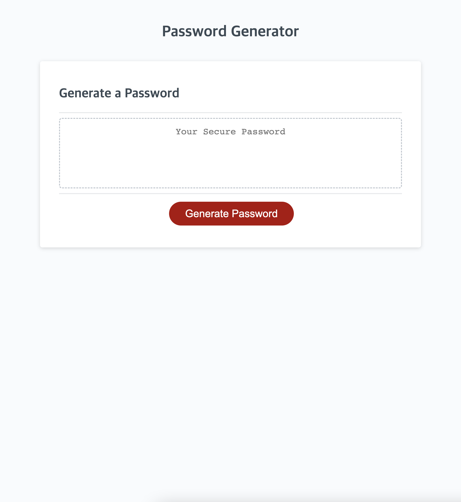

# i_generate_it_4_u

## Description
In this project, I coded a random password generator by using Javascript.
Start code was provided and my main role was to
* Enable password generate button 
* Be able to decide a password criteria between 8 characters to 128 characters
* Be able to choose character types: Numeric, Uppercase, Lowercase, Special characters
* Make genarated password visible on the display

## Screenshot

## Screenshot
During working on the assignment, I learned following things -
* how to use variables
* how to connect window.prompt, alert, and confirm
* how to check result by using console.log()
* how to use for loop and return its result

## Deployed application link
https://d0kd0.github.io/i_generate_it_4_u/